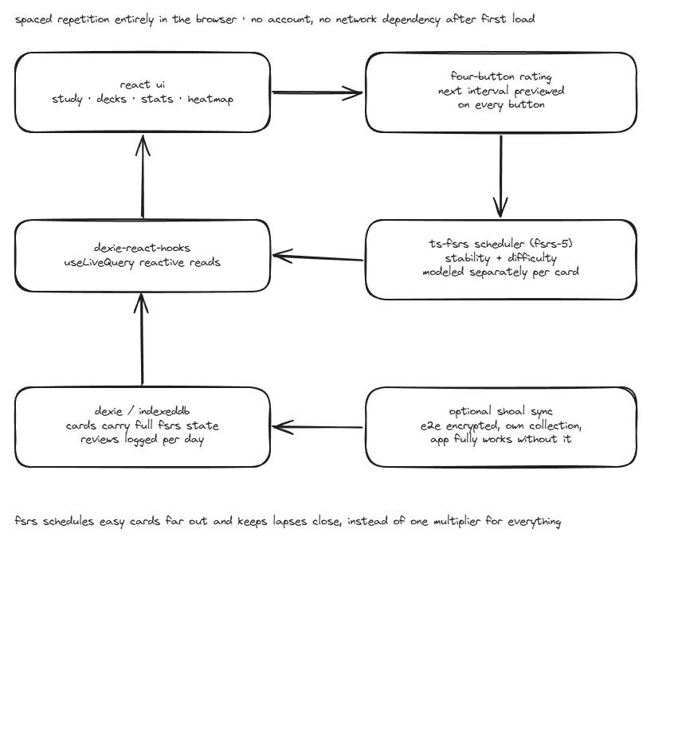

# mnemonic

Spaced-repetition flashcards that run entirely in the browser. Scheduling uses FSRS-5, and
every card, review, and statistic lives in IndexedDB, so there is no account, no server, and
no network dependency after first load.

[Live demo](https://mnemonic.edfl.dev)



## Why FSRS instead of SM-2

SM-2, the algorithm behind most flashcard apps, adjusts one number per card and assumes your
memory decays the same way for every piece of material. FSRS models two variables separately:
**stability** (how long the memory lasts) and **difficulty** (how hard the card is for you).
That lets it schedule a card you find easy far further out than one you keep failing, rather
than moving both by the same multiplier.

Cards store the FSRS fields directly (`stability`, `difficulty`, `elapsed_days`,
`scheduled_days`, `reps`, `lapses`, `learning_steps`, `state`), so the scheduler's full state
is inspectable in the database rather than hidden behind a derived interval.

## Features

- Four-button rating (again, hard, good, easy) with the next interval previewed on each button
  before you commit
- Keyboard-driven study sessions: space flips, `1` through `4` rate
- 52-week calendar heatmap of review activity, anchored to Monday
- Per-deck state breakdown (new, learning, review, relearning)
- Deck and card CRUD, plus a "load sample data" seed for trying it without typing cards first

## Stack

| Layer | Choice |
|---|---|
| UI | React 19, React Router v7, Tailwind CSS 4 |
| Scheduling | `ts-fsrs` v5 (FSRS-5) |
| Persistence | Dexie v4 over IndexedDB, with `useLiveQuery` for reactive reads |
| Build | Vite 8, TypeScript |
| Design | [Ash Lumen](https://ash-lumen.edfl.dev), monochrome, light and dark from one token source |

## Run

```bash
pnpm install
pnpm dev          # http://localhost:5173
pnpm build        # production build
pnpm tsc --noEmit # type check
```

## Implementation notes

Two things about `ts-fsrs` cost more time than expected and are worth writing down.

`Rating.Manual = 0` is excluded from the `IPreview` type, so indexing the scheduling result by
rating requires casting to `Grade`. The type is correct and the ergonomics are not.

`scheduled_days` reads 0 for cards in the learning phase, because their steps are sub-day. Any
interval shown to the user has to come from `due.getTime() - now` instead, otherwise every
learning card claims it is due in zero days.

Review logs store a local `YYYY-MM-DD` date string rather than a timestamp. The heatmap counts
reviews per calendar day as the user experienced them, so converting from UTC at render time
would shift late-night reviews into the wrong square.

## Related

[habit-tracker](https://github.com/emerson-d-lopes/habit-tracker) applies the same local-first
pattern to habit streaks. Both are styled with
[ash-lumen](https://github.com/emerson-d-lopes/ash-lumen).

## License

MIT

